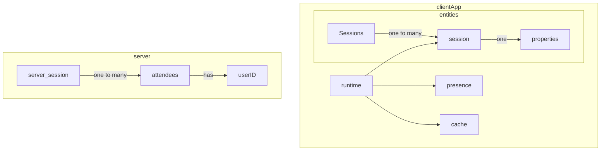

```mermaid
graph TD
subgraph clientApp
  cache
  presence
  runtime --> presence
  subgraph entities
    Sessions -- one to many --> session
    session -- one --> properties
    
  end
  
  runtime --> session
  runtime --> cache
  
end

subgraph server
  server_session
  server_session -- one to many --> attendees
  attendees -- has --> userID
end
```